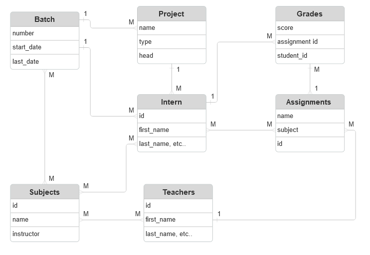

# Purpose :
 The aim is to design a database that can be used:
 * for storing scores of grading assignments of students
 * storing information of interns, instructors.
 * for analyzing progress of interns for subjects under a given instructor
 * for analyzing general progress of interns across batches

# Requirements:

The Database should be able to represent:
- Interns
- Instructors
- grades for Interns for each subject
- final/average grades of Interns.
- Intern-Instructor relationship
- Projects
- Intern, Instructor and project relationship

The Sabudh Institution takes Interns in Batches

# ER Diagram for Database

## Entities:

- **Batch**
- **Intern (Student)**
- **Instructor**
- **Subject**
- **PassionProject**
- **Assignment**
- **Grade**

## Attributes for each entity:

- **Batch**:
   - Batch Number (Primary Key)
   - Start Date
   - End Date

- **Intern (Student)**:
   - ID (Primary Key)
   - Type (Full Time or Part Time)
   - First Name
   - Last Name
   - Email Address
   - Phone Number
   - Date Of Birth
   - Gender
   - Batch Number (Foreign Key referencing Batch)

- **Instructor**:
   - ID (Primary Key)
   - First Name
   - Last Name
   - Email Address
   - Phone Number

- **Subject**:
   - ID (Primary Key)
   - Subject_Name
   - Instructor ID (Foreign Key referencing Instructor)

- **PassionProject**:
   - ID (Primary Key)
   - Name
   - Type
   - Head Instructor (Foreign Key referencing Instructor)
   - Guide Instructor1 (Foreign Key referencing Instructor)
   - Guide Instructor2 (Foreign Key referencing Instructor)

- **Assignment**:
   - ID (Primary Key)
   - Subject ID (Foreign Key referencing Subject)
   - Assignment Topic
   - Total Score
   - Instructor (Foreign Key referencing Instructor)

- **Grade**:
   - Student ID (Foreign Key referencing Intern)
   - Subject ID (Foreign Key referencing Subject)
   - Assignment ID (Foreign Key referencing Assignment)
   - Teacher ID (Foreign Key referencing Instructor)
   - Score
   - Date

## Relationships Between Entities:

### Batch - Student Relationship:
* A Batch can consist of Many Students
* A Student can have only One Batch
* One to Many Relationship

<!-- ### Student - Instructor:
* A Student Can Have At Least One or Many Instructors
* An Instructor Can Have Many Students
* Many to Many Relationship -->

### Batch - Instructor:
* A batch Can Have At Least One or Many Instructors
* An Instructor may Have instructed Students in many batches.
* Many to Many Relationship

<!-- ### Student - Subject:
* A student can have many students
* A Subject can have many students
* Many to Many Relationship -->
### Batch - Subject:
* A batch can have many subjects
* A Subject can have many batches
* Many to Many Relationship

### Subject - Instructor:
* A Subject can have One or many Instructor
* AN Instructor can teach one subject
* One to Many Relationship

### Student - PassionProject:
* A student can take part in one project
* A Project can have many students
* Many to One Relationship

### Assignment - Grade (For Student):
* An Assignment can have one grade
* A grade can be associated with one assignment
* One to One Relationship

# Optimizations :
- Removed Subject ID from Grade Entity because we can link grade with subject through assignment entity.
- Shift Student Instructor Relationship to Batch Instructor Relationship, for memory saving.
- Shift Subject-Student Relationship with Batch - Subject Relationship for memory saving.

## Views:
- Created View for Average Scores of a Given Student
- Created View for Average Intern Scores Under a Given Instructor

## Indices:
- Indices for Where clauses
- Indices for Foreign Keys

# Limitations :
- Database in Sqlite3 is not secure
- Many Indices result in more memory usage.